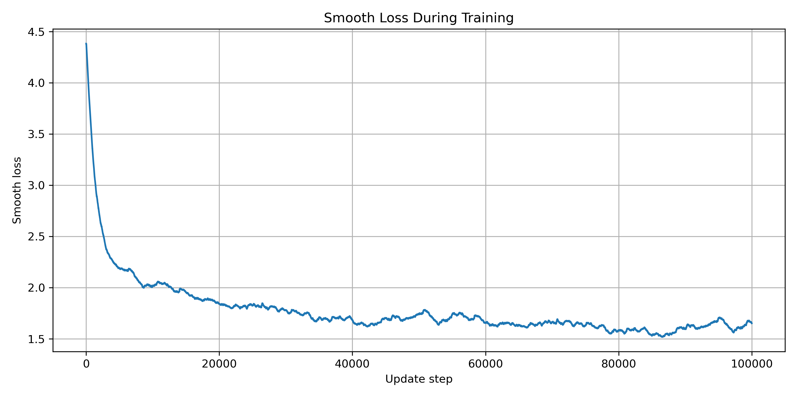
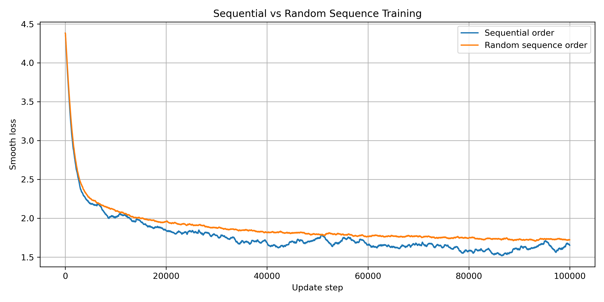

# DD2424 Assignment 4: Vanilla RNN Text Generation

This repository contains my implementation for DD2424 Assignment 4. The goal of the assignment is to train a vanilla recurrent neural network to synthesize English text character by character using the text from *Harry Potter and the Goblet of Fire*.

The implementation is written mainly in NumPy, including the forward pass, back-propagation through time, Adam optimization, text synthesis, and training loop. PyTorch is only used for gradient checking through automatic differentiation.

## Project Overview

The model is a character-level vanilla RNN. At each time step, the RNN receives one character represented as a one-hot vector and predicts the probability distribution of the next character.

For a sequence of characters, the input sequence and target sequence are shifted by one character. For example:

```text
Input:  H a r r
Target: a r r y
```

Thus, the model learns to predict the next character at every time step.

The RNN equations are:

```text
a_t = W h_{t-1} + U x_t + b
h_t = tanh(a_t)
o_t = V h_t + c
p_t = softmax(o_t)
```

The trainable parameters are:

```text
U: input-to-hidden weights
W: hidden-to-hidden weights
V: hidden-to-output weights
b: hidden bias
c: output bias
```

## Repository Structure

```text
vanilla-rnn-textgen/
├── data/
│   └── goblet_book.txt
├── src/
│   ├── rnn.py
│   ├── train.py
│   ├── gradient_check.py
│   ├── plot_loss.py
│   ├── rnn_bonus.py
│   ├── train_bonus.py
│   ├── bonus_sampling.py
│   ├── plot_bonus_random_loss.py
│   └── speed_bonus.py
├── figures/
│   └── smooth_loss_100000.png
├── results/
│   ├── loss_history.npy
│   ├── best_rnn.npz
│   ├── best_model_sample_1000.txt
│   ├── sample_update_000000.txt
│   ├── sample_update_010000.txt
│   ├── ...
│   └── train_100000_log.txt
├── results_bonus/
│   ├── bonus_sampling_log.txt
│   ├── speed_bonus_log.txt
│   ├── random_loss_history.npy
│   ├── random_best_rnn.npz
│   ├── random_best_model_sample_1000.txt
│   └── ...
├── report/
├── README.md
└── .gitignore
```

Some generated files in `results/` and `results_bonus/` may not be included in the GitHub repository depending on the `.gitignore` settings.

## Main Components

### Data preprocessing

Implemented in `src/rnn.py`.

The code reads the training text, extracts all unique characters, and builds two mappings:

```python
char_to_ind  # character -> integer index
ind_to_char  # integer index -> character
```

Each character is represented as a one-hot vector of dimension `K`, where `K` is the number of unique characters in the training text.

In this experiment:

```text
Number of characters in the book: 1,107,542
Number of unique characters K: 80
```

### RNN implementation

Implemented in `src/rnn.py`.

The file contains:

```text
read_book_data()
build_char_mappings()
chars_to_one_hot()
one_hot_to_chars()
initialize_rnn_parameters()
softmax()
forward_pass()
backward_pass()
synthesize()
initialize_adam_state()
adam_update()
```

The implementation uses the column-wise convention:

```text
X: K × seq_length
Y: K × seq_length
h_t: m × 1
U: m × K
W: m × m
V: K × m
b: m × 1
c: K × 1
```

### Gradient checking

Implemented in `src/gradient_check.py`.

The analytical gradients from the NumPy implementation are compared against PyTorch autograd on a smaller network with:

```text
hidden size m = 10
sequence length = 25
```

The relative errors for all parameters were around `1e-11`, which indicates that the manual back-propagation implementation is correct.

### Training

Implemented in `src/train.py`.

The model is trained using Adam with the following main hyperparameters:

```text
Hidden size: 100
Sequence length: 25
Learning rate: 0.001
Number of updates: 100,000
Optimizer: Adam
```

The training loop saves the smooth loss history, synthesized text samples during training, the best model parameters, and a 1000-character passage generated from the best model.

### Plotting

Implemented in `src/plot_loss.py`.

This script loads `results/loss_history.npy` and generates a smooth loss curve.

## How to Run

### 1. Test the RNN utilities

```bash
python src/rnn.py
```

This checks data preprocessing, parameter initialization, forward pass, text synthesis, backward pass, and Adam update shapes.

### 2. Run gradient checking

```bash
python src/gradient_check.py
```

This compares the manually computed gradients against PyTorch autograd.

### 3. Train the model

For the final long run:

```bash
python -u src/train.py | tee results/train_100000_log.txt
```

The `-u` flag is used to make Python print training logs immediately when piping output through `tee`.

### 4. Plot the smooth loss curve

```bash
python src/plot_loss.py
```

This saves the smooth loss plot to:

```text
DD2424 Assignment 4 Report/smooth_loss_100000.png
```

## Main Results

The smooth loss decreased rapidly during the early phase of training and continued to improve more gradually afterwards.

```text
Initial smooth loss: 4.3821
Final smooth loss: 1.6513
Best smooth loss: 1.5174
```



The generated text also improved during training. Before training, the model produced random characters and symbols. After training, the generated text showed more English-like structure, including spaces, punctuation, quotation marks, common word fragments, and names such as Harry, Hermione, Ron, Dumbledore, Sirius, Cedric, and Voldemort-like fragments.

A 200-character sample after 100,000 update steps:

```text
rizg to be decenn of a chores, dhe trankatipual any looky's weok."
They goory falling here up that go suppowed of Dumbledore in Hally.
"I're, they will stop fidear yeared event."
Thouch they longide,
```

The generated passages are not fully coherent, but they demonstrate that the vanilla RNN learned meaningful character-level patterns from the training text.

## Bonus Experiments

I also implemented several bonus experiments in independent bonus files so that the original main assignment code remains unchanged.

### Bonus 1: Random sequence training order

Implemented in:

```text
src/train_bonus.py
src/plot_bonus_random_loss.py
```

In the main training loop, the RNN scans through the book sequentially and passes the final hidden state from one segment to the next. In the random sequence bonus experiment, each update step samples a random position from the book:

```text
X = book_data[e:e+seq_length]
Y = book_data[e+1:e+seq_length+1]
```

Since consecutive sampled sequences are not necessarily adjacent in the original text, the hidden state is reset to zero at every update step.

The random-sequence experiment was also run for 100,000 update steps.

Results:

```text
Sequential training final smooth loss: 1.6513
Sequential training best smooth loss:  1.5174

Random-sequence final smooth loss:     1.7213
Random-sequence best smooth loss:      1.7053
```

The sequential training strategy performed better, which suggests that preserving the natural order of the text and carrying the hidden state across consecutive segments is beneficial for this vanilla RNN.

### Bonus 2: Sampling strategies

Implemented in:

```text
src/bonus_sampling.py
```

This experiment uses the best trained RNN model and changes only the text synthesis strategy. I implemented:

```text
Temperature sampling
Nucleus sampling
Combined temperature + nucleus sampling
```

Temperature sampling modifies the sharpness of the probability distribution:

```text
p = softmax(o / T)
```

Nucleus sampling keeps only the smallest set of characters whose cumulative probability exceeds a threshold `theta`, then renormalizes the remaining probabilities before sampling.

The tested settings were:

```text
Temperature:
T = 0.5, 1.0, 1.5

Nucleus:
theta = 0.5, 0.8, 0.95

Combined:
conservative: T = 0.7, theta = 0.8
balanced:     T = 1.0, theta = 0.9
creative:     T = 1.3, theta = 0.95
```

Qualitatively, low-temperature and low-threshold settings produced more stable but repetitive text. High-temperature and high-threshold settings produced more diverse but noisier text. Among the combined settings, `T = 1.0` and `theta = 0.9` gave the best balance between diversity and readability.

### Bonus 3: Speeding up gradient computations

Implemented in:

```text
src/speed_bonus.py
```

This experiment optimizes the forward and backward computations by exploiting the one-hot structure of the input characters.

In the original implementation, the input-to-hidden computation is:

```text
U @ x_t
```

Since `x_t` is one-hot, this multiplication simply selects one column of `U`. The optimized implementation replaces it with direct column indexing:

```text
U[:, i_t]
```

Similarly, in the backward pass, only the active column of `grad_U` is updated. The optimized implementation also uses `np.outer` for the outer-product gradient computations of `W` and `V`.

Correctness check:

```text
Original loss: 4.436350806431
Fast loss:     4.436350806431
Loss abs diff: 0.000000000000e+00

Gradient differences for U, W, V, b, c:
max absolute difference = 0
relative error = 0
```

Speed benchmark with 2000 repeats:

```text
Original total time: 38.088104 seconds
Fast total time:     10.896692 seconds
Speedup:             3.50x
```

The optimized implementation is mathematically equivalent to the original version and achieves approximately a 3.5x speedup.

## Bonus Summary

The bonus experiments explored three different aspects of the character-level RNN.

First, the sampling experiments showed that generation quality depends strongly on how the next character is sampled from the probability distribution. Conservative sampling settings improve stability but can cause repetition, while more creative settings improve diversity but increase noise.

Second, the random sequence training experiment showed that randomizing the sequence order did not improve this vanilla RNN. Sequential training achieved a lower smooth loss, likely because it preserves hidden-state continuity across consecutive text segments.

Third, the speed optimization experiment showed that exploiting one-hot input structure can significantly reduce computation time without changing the mathematical result.

Together, these experiments provide additional insight into generation quality, training dynamics, and computational efficiency for character-level RNNs.

## Notes

The model is intentionally a simple vanilla RNN, as required by the assignment. More advanced architectures such as LSTM, GRU, or Transformer models would likely generate more coherent text, but they are outside the scope of the required implementation.